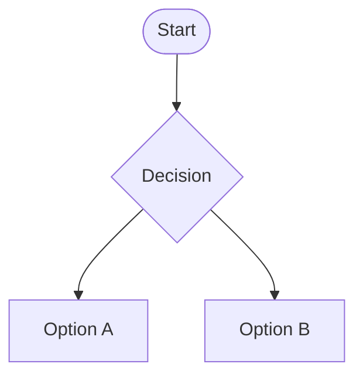

# behind the scene CSS

3 pillars to write good html and CSS and build good websites

- responsive design
- maintainable and scalable code
- web performance

Responsive design

- fluid layouts
- media queries
- responsive images
- correct units
- desktop-first vs mobile-first

Maintainable and scalable code

- clean
- easy to understand
- supports growth
- reusable
- how to organize files
- how to name classes
- how to structure html

Web performance

- less HTTP requests
- less code
- compress code
- use a CSS preprocessor
- less images
- compress images

```mermaid
What happens to CSS when we load up a webpage
            Load HTML --> Parse HTML ---------------------------------> Document Object Model(DOM)------|
                            |                                                                           |
                            |                                                                           |
                            |                                                                           |
                            v                                                                           |
                        Load CSS ------------->Parse CSS --------------> CSS Object Model(CSSOM)--------|
                                        |                                                               |
                                        1. Resolve conflicting CSS declaration(cascade)                 |
                                        2. Process final CSS values                                     |
                                                                                                        |
Final rendered<--------- Website rendering:       <----------------------Render Tree <------------------|
website              the visual formatting model
```

## The CASCADE in CSS

Process of combining different stylesheets and resolving conflicts between different CSS rules and
declarations, when more than one rule applies to a certain element

- Author declaration
- User
- Browser declaration(user agent)

## TO RESOLVE CONFLICTS

```
importance(weight)                                        >            specificity                                   >              source order
1. User !important declaration            same                  1. inline styles                          same                     The last declarations in the code
2. Author !important declaration        importance?             2. IDs                                 specificity?                 will override all other declarations
3. Author declaration------------------------------------->     3. classes, pseudo-classes, attribute ---------------->            and will be applied
4. User declaration                                             4. elements, pseudo-elements
5. Default browser declarations
```

Example

```css
.button {
    font-size: 20px;
    color: white;
    background-color: blue !important; ----> This will be applied because of !important
}

#nav.pull-right .button{
    background-color: green;
}
```

```css
                                                            Inline      IDs            Classes                     Elements

.button { Specificity 0 0 1 0
font-size: 20px;
 color: white;
 background-color: blue
}

nav#nav div.pull-right .button { 0 1(#nav) 2(pull right,button) 2(nav, div)
background-color: green;
}

a { 0 0 0 1
background-color: purple;
}

#nav a.button: hover { 0 1(#nav) 2(button, hover-pseudo class) 1 (a)
 background-color: yellow;
}
```

background color will be green on the basis of specificity

## Summary:

- CSS declarations marked with !important have the highest priority
- But, only use !important as a last resource. It's better to use correct specificities - more maintainable code!
- Inline styles will always have priority over styles in external stylesheets;
- A selector that contain 1 ID is more specific than one with 1000 classes;
- A selector that contains 1 class is more specific than one with 1000 elements;
- The universal selector \* has no specificity value (0, 0, 0, 0);
- Rely more on specificity than on the order of selectors;
- But, rely on order when using 3rd-party stylesheets - always put your author stylesheet last.

## VISUAL FORMATTING Model

Algorithm that calculates boxes and determines the layout of these boxes, for each element in the render tree,
in order to determine the final layout of the page

- dimensions of boxes: the box model
- Box type: inline, block, inline-block
- Positioninh scheme: floats and positioning
- Stacking contexts
- other elements in the render tree(siblings or parent)
- viewport size, dimensions of images, etc.

````


````
